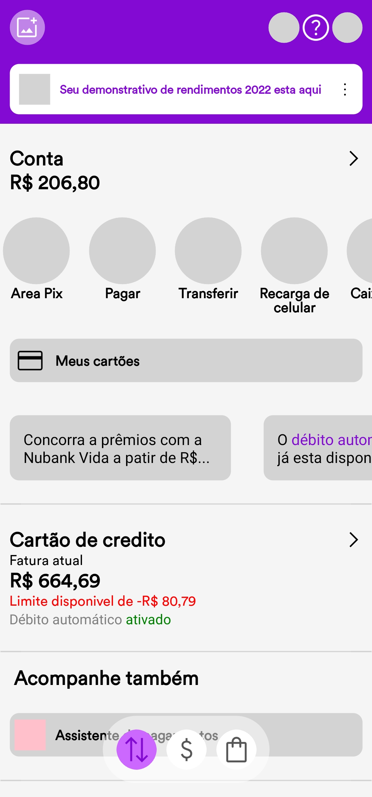
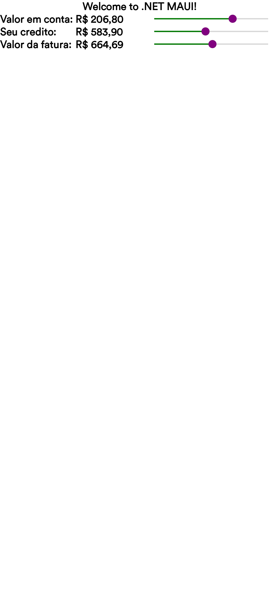

# Fake-NU

Este é um projeto de exemplo que mostra como usar o Net Maui e o pacote nuget LocalData (também de autoria minha e é compativel com qualquer projeto .net) para criar um aplicativo inspirado no layout do Nubank.

## Recursos

- Net Maui: uma plataforma multiplataforma para criar aplicativos nativos para Android, iOS, macOS e Windows com C# e XAML.
- LocalData: um pacote NuGet que permite armazenar e acessar dados locais de forma simples e rápida usando criptografia. 'https://nuget.org/packages/LocalData'
- Google Fonts Icons: uma coleção de ícones gratuitos e de alta qualidade para uso em projetos de design. 'https://fonts.google.com/icons'
- Nubank:É um banco digital que oferece serviços financeiros como cartão de crédito, conta digital, investimentos e empréstimos, e foi inspiração do projeto devido devido a diversidade de itens no seu layout.
## Como usar

Para executar este projeto, você precisa ter o Visual Studio 2022 ou superior instalado em seu computador. Você também precisa ter o SDK do Net Maui e as ferramentas necessárias para cada plataforma que você deseja testar.

Siga os passos abaixo para clonar e executar o projeto:

1. Abra o terminal e navegue até a pasta onde você deseja salvar o projeto.
2. Digite o seguinte comando para clonar o repositório: `git clone https://github.com/magnogtsouza/Fake-NU.git`
3. Abra o Visual Studio e selecione a opção "Abrir um projeto ou solução".
4. Navegue até a pasta onde você clonou o projeto e abra o arquivo "Fake-NU.sln".
5. Selecione a plataforma e o dispositivo que você deseja usar para depurar o aplicativo e clique no botão "Iniciar depuração".
6. Aguarde o aplicativo ser compilado e executado no dispositivo escolhido.

## Capturas de tela

Aqui estão algumas capturas de tela do aplicativo Android:
  

## Licença

Este projeto está licenciado sob a licença MIT.